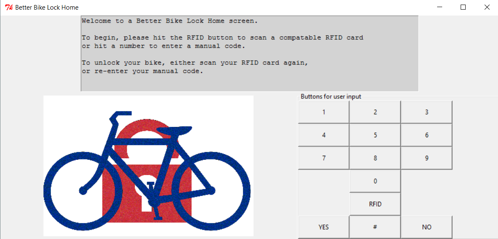

### Note to Dr. Gourd:
To view the final code please see the Working_Code.py file.  
  
To just view the GUI and Manual code method, download the bikelock.gif and WorkingCode-GUIandManual_Input.py files   
These should function on any computer that has python with the Tkinter module.

#### Louisiana Tech Engineering HNRS 122- H05 Final Project
## Lock Control System 
#### Project Title: Better Bike Lock   

A simple Python script for reading codes from the Parallax RFID Reader 28140 (Serial port version) was forked from github user cspenscer.
This code was then modified and built upon to meet the needs of our project. The system takes in user input either from an RFID card or manually from a keypad built into the GUI. 

##### Project Description: 
We used a Raspberry Pi 3 to serve as the main control for the program and the <b>Working Code.py</b> file is the one which contains themost up to date and functioning code. 

##### Project Materials: 
  * Raspberry Pi 3
  * 7in LCD touchscreen display
  * Arduino Uno
  * 2 SPST relays
  * 2 transistors
  * 2 Linear Actuators 
  * A 18" x 24" sheet of Acrylic cut into a box to house the electrical components

Elements that were added to cspencer's original code include: 

* A GUI with buttons and a picture
* and A locking method for RFID and manual inputs.
